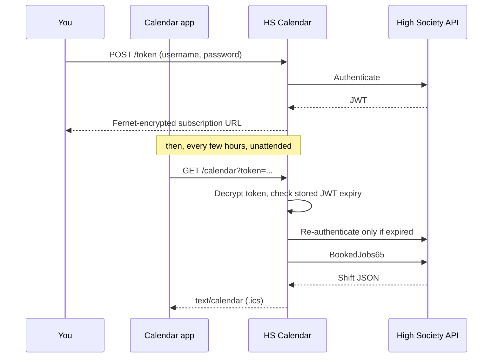

# HS Calendar

A self-hosted Flask service that turns High Society staff shifts into a live calendar subscription, so they appear automatically in iOS Calendar, Google Calendar or Outlook — with pay rates, staffing count and uniform requirements the official app never shows.

Subscribe once and the feed re-authenticates and refreshes on its own from then on.

## Why?

High Society is a catering agency that books waiters onto events via its own staff app. The app has two problems:

- **Shifts are buried behind menus.** Finding the date or location of a shift takes several taps, and there's no way to see your week at a glance or spot a double-booking against the rest of your life.
- **The API returns more than the app shows.** Each shift's response includes the rate of pay (which varies per shift and is never disclosed to staff) and how many waiters are booked (a good proxy for event size) — the app displays neither.

A subscription calendar solves both: shifts appear automatically in the calendar you already use, updating whenever your schedule changes, with the hidden pay and staffing data on every event.

## Reverse-engineering the API

There's no public API or documentation, so the first job was working out how the app talks to its backend. I used [mitmproxy](https://mitmproxy.org/) to inspect the traffic from the High Society app on my phone, capturing each request, and intercepting to edit requests and responses.

| Endpoint                                | Purpose                           |
|-----------------------------------------|-----------------------------------|
| `POST /api/Authentication/Authenticate` | Username + password → JWT         |
| `GET /api/EMSSecurityUserItems60`       | Username → internal staff ID      |
| `GET /api/BookedJobs65`                 | Every booked shift for a staff ID |

## Security issues found, and disclosed

Mapping the API surfaced several vulnerabilities. The most serious was an **IDOR**: `BookedJobs65` took a `staffId` parameter and never checked it against the identity in the bearer token. Any authenticated member of staff could read anyone else's shift data: venues, rates, schedules. While not tested, this likely affected password resetting too.

These were reported to High Society and fixed within a week.

## How it works



## Security: Token-based Authentication

Calendar clients can't log in. They GET a URL on a schedule, forever, with no way to prompt for credentials — so everything the feed needs to re-authenticate has to live in that URL.

That token is a Fernet-encrypted (AES-128-CBC + HMAC) JSON blob:

```json
{"u": "<username>", "p": "<password>", "kid": "<key_id>"}
```

Only the server holds the key, so the token is opaque to the calendar client and to anyone who intercepts the link.

**This makes the subscription URL password-equivalent**, which the design accepts openly. The mitigations:

- **The password is never persisted** — the database holds only username, JWT, expiry, staff ID and key ID. The password exists solely inside the user's own token.
- **A leaked link doesn't leak the password** — without the server's Fernet key, the blob can't be decrypted.
- **The exposed surface is read-only** — the token can read your shift feed and nothing else. It can't modify shifts, reveal personal details, or sign in to the official app.
- **Revocation is built in** — each token embeds a key ID checked on every request; incrementing the stored value invalidates every link issued so far.

Plus: per-IP rate limiting (`CF-Connecting-IP` aware, so limits apply per client behind Cloudflare, not per proxy), and error responses that never carry a cause — browsers get one of two generic pages, with unhandled exceptions logged server-side only.

## Endpoints

| Route               | Method | Purpose                                         |
|---------------------|--------|-------------------------------------------------|
| `/`                 | GET    | Sign-in page that generates a subscription link |
| `/token`            | POST   | Credentials → encrypted token                   |
| `/calendar?token=…` | GET    | The iCalendar feed clients subscribe to         |
| `/raw?token=…`      | GET    | Raw upstream shift JSON, for debugging          |

## Stack

Flask (app factory + blueprint), SQLAlchemy with Alembic migrations, Flask-Limiter, `cryptography` for Fernet, PyJWT, `icalendar`. The frontend is a single dependency-free template — no build step, no framework, no external requests.

## Running locally

```bash
uv sync

# Generate the Fernet key used to encrypt subscription tokens
python -c "from cryptography.fernet import Fernet; print(Fernet.generate_key().decode())"
echo "ENCRYPTION_KEY=<paste the key>" > .env

uv run flask --app app db upgrade
uv run flask --app app run
```

---

Not affiliated with High Society.
